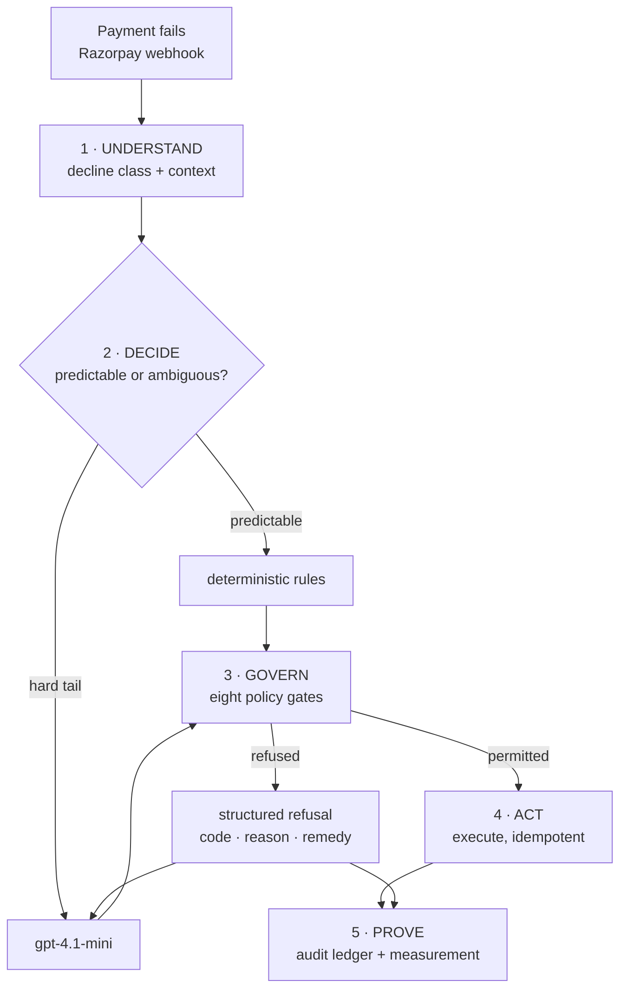

# Recoup — bounded revenue recovery for Indian subscription payments

**Razorpay AI Buildathon · Track 03 · AI Revenue Recovery**

A failed recurring charge is not one problem. It is four, and they need different
answers: an expired card can never be retried, an issuer outage will pass on its
own, an account short of funds will be topped up on payday, and an unrecognised
decline code should not be guessed at. Recoup diagnoses which it is, decides what
is worth doing, and — crucially — **cannot** take a money action its policy
engine has not permitted.

> **We did not build an AI we assume works. We built a system that can prove when
> AI helps, and when it doesn't.**
>
> The recovery system beat the platform default by **+21.6 points**. When we
> isolated the language model's own contribution, it made recovery **21.2 points
> worse**. Both numbers are below, with intervals, from runs whose raw output is
> committed.

---

## The two results

### R1 — does the system beat the platform default?

**n = 900 · seed 20260823 · [raw output](reports/run_r1_population.txt)**

| | treatment | holdout | delta |
|---|---|---|---|
| recovery rate | **0.7314** | 0.5158 | **+0.2156** |

95% CI **[+0.1538, +0.2774]** · **₹96,908.74** incremental · ₹0.0028 spent per rupee recovered

Nearly all of it lands on **soft declines (+0.316)** — the cases where a retry can
succeed and the only question is *when*. `insufficient_funds` recovered at 0.859
against 0.444 **using fewer attempts** (1.66 vs 2.57): better timing, less load
on the issuer, more money.

Hard declines are flat (−0.025), which is the correct result — no debit succeeds
on a dead card. The system's contribution there is stopping 103 cases
without spending a debit on them.

### R2 — does the language model beat the deterministic rules?

**n = 120/119 · `gpt-4.1-mini` · [raw output](reports/run_r2_ablation.txt)**

**Lift −0.2124**, 95% CI **[−0.3326, −0.0922]**. The interval excludes zero.

| subtype | delta | 95% CI |
|---|---|---|
| inbound_freetext | **−0.3682** | [−0.5599, −0.1765] |
| high_value | −0.2208 | straddles zero |
| ambiguous_diagnosis | −0.0843 | straddles zero |

**The model is worse than the rules it replaced.** Not neutral — worse, by about
21 recovery points, composing to **−₹2,021 per treated case**.

We know why. A separate behavioural probe shows it gets every *safety* judgement
right: it never proposed a debit on a hard decline, correctly waited out an
outage, correctly stopped when an instrument-repair request went unanswered.
What it gets wrong is **timing** — it proposed `wait +360h` on a case whose
pre-debit notice had already matured, burning 15 of a 21-day window. In a problem
where all the lift comes from acting at the right moment, an agent that defers
loses money.

Full analysis, including six named limitations: **[docs/RESULTS.md](docs/RESULTS.md)**

---

## Architecture



**The model proposes. The policy engine disposes.** Rules, model and human all
propose through one interface and are gated identically, so *"the AI did
something it shouldn't"* is not a failure mode this architecture admits —
independent of how the model behaves.

### Three things the model structurally cannot do

Not "is prevented from" — **cannot**, because the field does not exist:

| | how |
|---|---|
| state an amount | its output schema has no amount field; amounts come from the ledger |
| write a message | it picks a registered `template_id`; the system fills every variable |
| invent a money action | the action is a closed enum of eight |

### The eight gates

`consent` → `suppression` → `mandate` → `attempt_budget` → `quiet_hours` →
`cooldown` → `template` → `channel_economics`

Ordered most-fundamental-first. **Every gate runs on every action** — no
short-circuit — so the ledger can show the whole envelope was applied, not just
the first thing that failed. Refusals are *structured*: a code, an explanation,
when it clears, and which action would unblock it. That last field is what lets
the model re-plan instead of stalling.

Compliance is executable here, not a paragraph. RBI's e-mandate framework
requires a pre-debit notice ≥24h before *each* debit, so `NOTICE_PENDING` is a
state in the case lifecycle — a debit is always scheduled, never immediate. The
Fair Practices Code's 08:00–19:00 contact window is a gate that computes the
recipient's local time. TCCCPR/DLT is why the model never writes copy.

---

## Evidence stack

Every claim below is checkable in this repository without running anything.

| claim | code | test | measured |
|---|---|---|---|
| The model cannot bypass the mandate rule | [`gate_mandate`](src/recovery/policy/gates.py) | `test_debit_without_notice_is_refused_and_names_the_remedy` | 72 AFA-ceiling refusals (R2 run) |
| The model cannot state an amount | [`agent/schema.py`](src/recovery/agent/schema.py) | `test_an_injected_amount_is_ignored_rather_than_honoured` | schema has no amount property |
| A model outage does not stop the system | [`AgentPlanner`](src/recovery/agent/planner.py) | `test_model_outage_falls_back_without_raising` | 133 fallbacks; batch completed |
| A double-fired debit charges once | [`sim/provider.py`](src/recovery/sim/provider.py) | `test_double_fired_debit_does_not_debit_twice` | provider call count stays 1 |
| A forged webhook is rejected | [`providers/webhooks.py`](src/recovery/providers/webhooks.py) | `test_tampered_body_is_rejected` | Batch C: forgery rejected |
| A replayed webhook is dropped | [`WebhookReceiver`](src/recovery/providers/webhooks.py) | `test_replayed_delivery_is_dropped` | Batch C: replay dropped |
| Hard declines never consume an attempt | [`DeclineClass`](src/recovery/domain/failure.py) | `test_hard_declines_never_consume_a_debit_attempt` | 103 cases stopped, 0 debits |
| The holdout is comparable | [`runner.py`](src/recovery/batch/runner.py) | `test_self_cure_rate_is_comparable_across_arms` | organic 46 vs 45 |

---

## The audit trail

`--report` emits **one self-contained HTML file** — no server, no CDN, no
network. Click any case and read its full history: trigger → diagnosis →
proposed action → **all eight gates with pass/fail** → refusal with code and
remedy → re-plan → execution → outcome.

A 600-case run embeds **240 timelines, 1,832 events, 201 refusal traces** in
713 KB. Passing gates render too — an engine that only logs refusals cannot
demonstrate it ran.

```bash
python -m recovery.batch --report reports/audit.html
```

---

## Razorpay integration

Live against test mode. **[Batch C ledger](reports/batch_c_ledger.json)** · 159 events.

```
cases run          50/50        customers 50 · orders 50
orders verified    50/50        fetched back; amount and receipt matched
api calls          176 in 98.4s (20 throttled, backoff honoured)

live downtime      card 5 · netbanking 5 · upi 2 · fpx 2 blocking
webhooks           valid accepted · forged rejected · replay dropped
```

**The downtime feed is real.** Razorpay publishes active outages keyed by bank,
issuer, VPA handle and card network; the policy engine's outage gate consults
them, so that refusal follows genuine issuer state rather than a flag we
invented.

**Subscriptions is not enabled on this account** (`/v1/subscriptions` → 401), so
no mandate debit is performed and none is claimed. `RazorpayGateway.charge()`
refuses rather than substituting a payment link — reporting a
customer-authenticated payment as an automatic debit would make the recovery
numbers mean something else. Statistics come from the simulator; Batch C proves
the integration. Two claims, never merged.

---

## The harness rejects its own bad runs

R2 took four attempts. Three were **refused by the measurement code**:

| run | tail n | model-call failures | R2 | verdict |
|---|---|---|---|---|
| 1 | 300 | 84% | −0.119 | **VOID** |
| 2 | 1400 | 41% | −0.018 | **VOID** |
| 3 | 1200 | 27% | −0.032 | **VOID** |
| 4 | 700 | **11.9%** | **−0.212** | valid |

When too many model calls fail, the agent arm is mostly the deterministic
fallback — rules compared against rules, wearing an agent label. Such a run still
completes, still prints a lift, still attaches a confidence interval. On a
deadline that is exactly the number that ships by accident. So:

```
R2 ABLATION VOID: 41% of model calls failed, so the agent arm is mostly the
deterministic fallback. The R2 numbers below are not an ablation and must not
be reported as one.
```

The analysis plan — one primary metric, one secondary, everything else
descriptive — was **[pushed before any batch data existed](docs/analysis-plan.md)**.

---

## Running it

```bash
python -m pytest -q                          # 179 tests
python -m mypy src/                          # strict, 40 files
python -m recovery.batch                     # rules only, no dependencies
python -m recovery.batch --agent scripted    # exercises the agent loop, no spend

pip install -e ".[openai]"                   # live model
python -m recovery.batch --agent live --workers 12 --token-budget 700000

pip install -e ".[razorpay]"                 # live Razorpay test mode
python -m recovery.batch.live --cases 50
```

Credentials go in a gitignored `.env` — see [`.env.example`](.env.example). The
core has **no runtime dependencies**; provider SDKs import lazily inside their
adapters, so only the one you use needs installing.

**`gpt-4.1-mini` was chosen on measured grounds**, not availability. On one
identical case, `gpt-5-mini` spent its entire 1,024-token output budget reasoning
and returned nothing usable in 16.6s; `gpt-4.1-mini` returned a valid proposal in
88 tokens and 2.2s. Bounded planning over a closed action menu gains nothing from
extended reasoning.

---

## What this does not show

1. **These are simulation results.** The world model encodes the hypothesis that
   retry timing matters, so it cannot confirm that hypothesis. Real validation
   needs merchant data.
2. **Inbound free text is never generated** — the strongest theoretical argument
   for a model here (parsing promises to pay) is untested.
3. **No mandate debit was executed**, against Razorpay or anywhere.
4. **R2 detects ~18 points** at this n. A smaller true effect would be invisible.
5. **One model, one prompt.** The claim is about this configuration, not about
   language models.

---

## Documentation

- **[RESULTS.md](docs/RESULTS.md)** — every measured outcome, including the unflattering ones
- **[analysis-plan.md](docs/analysis-plan.md)** — pre-registered, pushed before any data
- **[domain brief](docs/research/2026-08-23-revenue-recovery-domain-brief.md)** — Razorpay error taxonomy, RBI/TRAI/DPDP envelope, the self-cure problem
