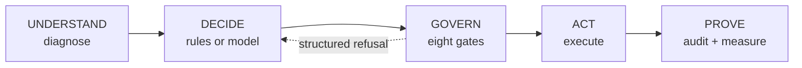

# Recoup — bounded revenue recovery for Indian subscription payments

**Razorpay AI Buildathon · Track 03 · AI Revenue Recovery**

A failed recurring charge is not one problem. An expired card can never be
retried. An issuer outage passes on its own. An account short of funds gets
topped up on payday. Recoup tells them apart, decides what is worth doing, and
**cannot** take a money action its policy engine has not permitted.

> **We did not build an AI we assume works. We built a system that can prove when
> AI helps, and when it doesn't.**

## Three measured results

| | question | result |
|---|---|---|
| **R1** | Does the system beat the platform default? | **+23.5 pts** · ₹1,08,422 incremental · 95% CI [+17.4, +29.6] |
| **R2** | Does the model beat rules at retry *timing*? | **−21.2 pts** · 95% CI [−33.3, −9.2] · **the model loses** |
| **R3** | Does the model beat keywords at *reading customers*? | **+12 pts** · McNemar p = 0.0019 · **the model wins** |

The model **loses at timing and wins at understanding.** Not a contradiction —
it is why the system routes rather than delegates. Rules keep control of
scheduling; the model handles language, and its output lands as *facts* in a
context the policy engine already gates.

Every figure comes from a run whose raw output is committed in
[`reports/`](reports/). Full analysis, limitations, and the corrections that
moved results *against* the model: **[docs/RESULTS.md](docs/RESULTS.md)**

## Real or simulated

| live against Razorpay | simulated |
|---|---|
| orders, customers, payment links — **50/50 verified server-side** | whether a given retry succeeds |
| **downtime feed** — 13 live outages, real bank codes, driving a real policy gate | which case hits which outage |
| webhook HMAC verification, forgery rejection, replay dedupe | customer payment behaviour |
| every model call — 508 real proposals in the committed audit report | inbound delivery (no public URL) |

Razorpay's test-mode charge is a dashboard button and **Subscriptions is not
enabled on this account** (`/v1/subscriptions` → 401), so the real path cannot
produce a batch of the size statistics need. The boundary is enforced in code:
`RazorpayGateway.charge()` **refuses** rather than substituting a payment link
and calling it a debit.

## How it works



**The model proposes. The policy engine disposes.** Rules, model and human all
propose through one interface and are gated identically, so *"the AI did
something it shouldn't"* is not a failure mode this architecture admits.

Three things the model **cannot** do — not "is prevented from", but *cannot*,
because the field does not exist in its output schema:

| | mechanism |
|---|---|
| state an amount | no amount field; amounts come from the ledger |
| write a message | it names a registered `template_id`; the system binds every variable |
| invent a money action | the action is a closed enum of eight |

Compliance is executable, not prose: RBI's ≥24h pre-debit notice is a lifecycle
state, the Fair Practices Code's 08:00–19:00 window is a gate computing the
recipient's local time, and TCCCPR/DLT is why the model never writes copy.

Design decisions and rejected alternatives: **[docs/architecture.md](docs/architecture.md)**

## One real case from the audit report

`gpt-4.1-mini`, nothing staged:

```
1  webhook  case_detected      charge failed: debit_instrument_blocked (hard)
2  agent    action_refused     proposal rejected: 'request_instrument_update'
                               sends a message but named no template
3  agent    state_changed      fell back to the deterministic planner
4  rules    action_refused     refused: request_instrument_update (quiet_hours)
5  agent    actions_proposed   model proposed request_instrument_update
6  rules    policy_evaluated   permitted: request_instrument_update via sms
7  system   action_executed    sent RP_INSTRUMENT_01 via sms
```

Three independent safety layers on one case: schema validation rejecting a
malformed model output, the deterministic fallback catching it, and a
contact-hours gate refusing a message outside 08:00–19:00.

`--report` emits one self-contained HTML file — no server, no CDN. A 300-case
run embeds **240 timelines, 2,885 events, 158 refusal traces.**

## Evidence stack

Checkable without running anything.

| claim | code | test | measured |
|---|---|---|---|
| The model cannot bypass the mandate rule | [`gates.py`](src/recovery/policy/gates.py) | `test_debit_without_notice_is_refused_and_names_the_remedy` | 72 AFA refusals |
| The model cannot state an amount | [`schema.py`](src/recovery/agent/schema.py) | `test_an_injected_amount_is_ignored_rather_than_honoured` | no amount property |
| A model outage does not stop the system | [`planner.py`](src/recovery/agent/planner.py) | `test_model_outage_falls_back_without_raising` | 133 fallbacks, batch completed |
| A double-fired debit charges once | [`provider.py`](src/recovery/sim/provider.py) | `test_double_fired_debit_does_not_debit_twice` | call count stays 1 |
| A forged webhook is rejected | [`webhooks.py`](src/recovery/providers/webhooks.py) | `test_tampered_body_is_rejected` | Batch C: rejected |
| Hard declines never consume an attempt | [`failure.py`](src/recovery/domain/failure.py) | `test_hard_declines_never_consume_a_debit_attempt` | 104 stopped, 0 debits |
| The holdout is comparable | [`runner.py`](src/recovery/batch/runner.py) | `test_self_cure_rate_is_comparable_across_arms` | organic 45 vs 45 |
| The R3 baseline is not a strawman | [`inbound.py`](src/recovery/agent/inbound.py) | `test_baseline_is_competent_enough_to_be_a_fair_opponent` | 80% intent, 97% suppression |

## The harness rejects its own bad runs

R2 took four attempts; three were refused by the measurement code because too
many model calls had failed, leaving the "agent" arm mostly deterministic
fallback — rules against rules, wearing an agent label.

| run | call failures | R2 | verdict |
|---|---|---|---|
| 1–3 | 84% / 41% / 27% | −0.119 / −0.018 / −0.032 | **VOID** |
| 4 | **11.9%** | **−0.212** | valid |

R3 was expanded from 47 to 153 messages after the first result came back at
p=0.23, and its baseline was corrected once it turned out to be handicapped —
which moved the effect from +19 to +12. The
[analysis plan](docs/analysis-plan.md) was pushed **before any batch data
existed**.

## Running it

```bash
python -m pytest -q                          # 396 tests
python -m mypy src/                          # strict, 57 files
python -m recovery.batch                     # rules only, no dependencies

pip install -e ".[openai]" && export OPENAI_API_KEY=...
python -m recovery.batch --agent live --workers 12 --token-budget 700000
python -m recovery.batch.inbound_bench       # R3

pip install -e ".[razorpay]"
python -m recovery.batch.live --cases 50     # Batch C
```

Credentials go in a gitignored `.env` ([template](.env.example)). The core has
**no runtime dependencies**; provider SDKs import lazily, so only the one you use
needs installing.

`gpt-4.1-mini` was chosen on measured grounds: on one identical case `gpt-5-mini`
spent its entire 1,024-token output budget reasoning and returned nothing usable
in 16.6s, against 88 tokens in 2.2s.

## What this does not show

1. **Recovery outcomes are simulated.** The world model encodes the hypothesis
   that retry timing matters, so it cannot confirm it. Real validation needs
   merchant data.
2. **No mandate debit was executed**, against Razorpay or anywhere.
3. **R3's corpus was written by the same author as the system**, stated in
   [`inbound_corpus.py`](src/recovery/sim/inbound_corpus.py).
4. **One model, one prompt.** The claim is about this configuration.

## Docs

- **[RESULTS.md](docs/RESULTS.md)** — every measured outcome, including the unflattering ones
- **[architecture.md](docs/architecture.md)** — the five layers, decisions, rejected alternatives
- **[analysis-plan.md](docs/analysis-plan.md)** — pre-registered, pushed before any data
- **[domain brief](docs/research/2026-08-23-revenue-recovery-domain-brief.md)** — Razorpay error taxonomy, RBI/TRAI/DPDP envelope
