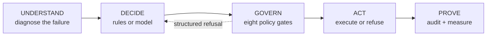
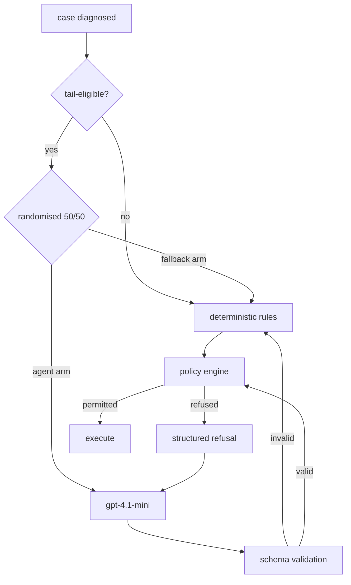

# Architecture

11,870 lines of source, 4,380 of tests, 396 tests, mypy strict clean.

This document explains what the system does, why each significant decision was
made, and what was rejected on the way. Where a decision is contestable it says
so, and where the evidence contradicts an early assumption it says that too.

---

## 1. The problem is four problems

"Revenue recovery" sounds like one pipeline. It isn't. Four leak surfaces share
a name and almost nothing else:

| surface | window | signal | "recovered" means |
|---|---|---|---|
| payment failure at checkout | minutes | `payment.failed` webhook | new payment on the same order |
| checkout abandonment | hours | **absence** — must be inferred | conversion attributable to a nudge |
| subscription / mandate failure | days–weeks | subscription → `pending` → `halted` | invoice paid, subscription active |
| B2B receivables | weeks–months | due date passed | cash received **and reconciled** |

They differ in intent decay, legal envelope, and what counts as success.
Abandonment detection is *inference* and carries a false-positive cost; B2B is a
relationship problem where the money usually exists and an approval doesn't.

**We built one vertical deep — subscription/e-mandate dunning — on a shared
spine.** It has the cleanest measurement story and the hardest regulatory
constraint (RBI's 24-hour pre-debit notice), which forces genuine timeline
planning rather than a retry loop. Adding another surface means new detectors
and playbooks, not a new spine.

---

## 2. Five layers



| layer | module | responsibility |
|---|---|---|
| UNDERSTAND | `domain/failure.py` | map a provider reason string to what recovery is possible |
| DECIDE | `planner/rules.py`, `agent/` | choose the next action and when |
| GOVERN | `policy/` | permit or refuse, with a reason |
| ACT | `providers/`, `batch/runner.py` | execute idempotently |
| PROVE | `domain/events.py`, `batch/metrics.py`, `report/` | record and measure |

---

## 3. UNDERSTAND — the decline taxonomy

Every provider failure maps to one of four classes, and the class determines
what is even permitted:

| class | meaning | permitted |
|---|---|---|
| **HARD** | instrument cannot succeed (`card_expired`, `invalid_vpa`, `debit_instrument_blocked`) | no debit, ever — instrument repair only |
| **SOFT** | retry is legitimate (`insufficient_funds`, `authentication_failed`) | retry; the whole question is *when* |
| **DOWNTIME** | issuer or gateway outage | wait for the resolve signal, not a timer |
| **UNKNOWN** | unmapped reason string | no debit; escalate for diagnosis |

**Decision: UNKNOWN is not folded into SOFT.** An unrecognised code means the
provider changed something or we're seeing an uncharacterised instrument. Letting
it inherit retry permission by default would spend a customer's goodwill and an
attempt-budget slot on a failure mode we cannot name. `DeclineClass.UNKNOWN.allows_debit_retry`
is `False`, and there is a test asserting it.

This costs us: R1 measured `unknown` at +0.250 in one arm on tiny n, and in the
tail batch the conservative policy loses to blind retrying on unmapped codes.
That's the measured price of the safety choice, and it's reported.

---

## 4. GOVERN — the policy engine

Eight gates, ordered from "can never be allowed" to "allowed but not worth it":

```
consent → suppression → mandate → attempt_budget
        → quiet_hours → cooldown → template → channel_economics
```

Each is a pure function of `(action, context) → GateResult`. No I/O, no clock of
its own, no hidden state — which is what makes the whole compliance surface
unit-testable without a database or a fake time library.

### Decision: every gate runs, no short-circuit

**Rejected:** stop at the first refusal, which is faster.

**Why:** two reasons, both load-bearing. An agent handed one violation at a time
plays whack-a-mole across several turns; handed all of them, it re-plans once. And
a compliance engine that stops at the first failure **cannot demonstrate the
remaining gates were evaluated** — passing results are what turn the ledger into
evidence. The checks are pure in-memory functions, so running all eight is free.

### Decision: refusals are structured objects, not error strings

A refusal carries a stable `code`, an `explanation`, a `retry_after` when waiting
would clear it, and a **`remediation`** naming an action that would unblock it.
That last field is what lets a model re-plan within bounds rather than guess.

```
refused: retry_debit (mandate=predebit_notice_required)
  → unblocked by: send_predebit_notice
```

### Compliance is executable, not prose

| rule | how it's enforced |
|---|---|
| RBI e-mandate: notice ≥24h before *each* debit | `NOTICE_PENDING` is a lifecycle state; a debit is always scheduled |
| RBI e-mandate: AFA above ₹15,000 (₹1,00,000 for insurance/MF/card-bill) | `gate_mandate` with the category carve-out |
| RBI Fair Practices Code: contact 08:00–19:00 | `gate_quiet_hours`, computed in the recipient's timezone |
| TRAI TCCCPR / DLT: registered templates only | `gate_template`; the model never writes copy |
| Card network reattempt ceilings | `gate_attempt_budget`, per-instrument 30-day window |

**Known unknown, handled conservatively:** the sources consulted do not settle
whether a retry of a *failed* e-mandate debit needs a fresh 24h notice or is
covered by the original. We assume fresh-notice-per-attempt — the safer reading
and the safer product behaviour. Documented at `domain/case.py`.

**Two deliberate exemptions**, argued at the gate: a statutory pre-debit notice
bypasses quiet hours and cooldown. Withholding a legally required disclosure to
satisfy an internal comfort rule means a late notice or a missed debit, and the
customer loses their opt-out window either way.

---

## 5. DECIDE — where the model sits



### Three things the model structurally cannot do

Not "is prevented from" — **cannot**, because the field does not exist in its
output schema:

| | mechanism |
|---|---|
| state an amount | no amount field; amounts come from the ledger at execution |
| write a message | it emits a registered `template_id`; the system binds every variable |
| invent a money action | the action is a closed enum of eight |

**Rejected:** letting the model emit message text with a validation pass
afterwards. On DLT-registered SMS, free-form copy is not sendable at all, so a
model that writes prose is generating something that can never be used. Making
it choose a template turns a regulatory constraint into an architectural one.

**Rejected:** letting the model bind template variables. It names the template;
`templates.bind_variables` fills every value from the ledger. Centralised so the
rules path and the agent path cannot diverge in what may reach a customer.

### The re-plan loop

Bounded to two re-plans. Every exit path has been through the same eight gates:
permitted → returned; refused → re-planned then falls back; malformed → falls
back; model unavailable → falls back. **The fallback is not an error path — it is
the system's floor**, and R2 measures whether the model clears it.

---

## 6. PROVE — measurement

Two independent randomisations, and keeping them separate is what makes the
experiments readable.

**R1** — global 50/50, stratified by decline class and amount decile.
*Does the system beat the platform default?*

**R2** — within tail-eligible treatment cases, another 50/50: agent loop vs
deterministic fallback. *Does the model beat rules, on the cases it actually
handles?*

### Decision: randomise **within** the tail

**Rejected:** compare agent-handled cases against the general rules-handled
population.

**Why:** cases reach the tail *because they are hard*. That comparison would
measure the router, not the model. Both R2 arms sit inside R1's treatment arm,
which makes R1 a blended system number and R2 the model number.

### Decision: assignment is hash-derived, not drawn from a shared PRNG

`sha256(salt + case_id)`. Assignment therefore doesn't depend on processing
order, so adding a case to a batch cannot silently reshuffle every case after it.

### Decision: case-level recovery carries no action attribution

**Rejected:** an earlier definition requiring "no intervening action."

**Why:** that excludes the normal multi-touch shape (`notice → retry → link →
paid`) — precisely the cases of interest. Whether the invoice was paid inside
the window is the entire question. Action-level attribution survives only for
cost slices.

### The self-cure baseline

A large share of failed payments recover with no intervention. Counting every
post-intervention payment as "recovered by the agent" would claim other people's
work. Organic recoveries were **45 vs 45** across arms in the R1 run — a balanced
baseline is what makes the comparison sound.

**A bug this caught:** self-cure was originally credited only while a case was
still active. The control arm exhausts attempts sooner, stops, and stops being
watched — so it was credited with fewer organic payments *purely because it quit
earlier*, inflating measured lift. Now the observation window defines the period,
not our attention span, and a test asserts arm parity.

### The void check

When too many model calls fail, the agent arm is mostly the deterministic
fallback — rules against rules, wearing an agent label. Such a run still
completes, still prints a lift, still attaches a confidence interval. **Three of
four R2 runs were rejected by this check** (84%, 41%, 27% failure) before the
fourth (11.9%) was accepted.

---

## 7. What is real and what is simulated

The most common objection, answered precisely rather than defensively.

| real | simulated |
|---|---|
| Razorpay orders, customers, payment links (50/50 verified server-side) | recovery outcomes — whether a retry succeeds |
| **Live downtime feed** — 13 active outages, real bank codes (SBIN, CITI, PUNB), feeding `gate_mandate` | which case experiences which outage |
| Webhook HMAC-SHA256 verification, forgery rejection, replay dedupe | webhook delivery (no public URL) |
| Provider rate limiting and backoff | customer payment behaviour |
| Every model call — 508 real `gpt-4.1-mini` proposals in one report | inbound free text (never generated) |
| The policy engine, in both paths | |

**Why the split is structural, not laziness:** Razorpay's test-mode manual charge
is a dashboard button operated one case at a time, and Subscriptions is not
enabled on this account (`/v1/subscriptions` → 401). The real path *cannot*
produce a batch of the size statistics require. `RazorpayGateway.charge()`
refuses rather than substituting a payment link — reporting a
customer-authenticated payment as an automatic debit would make the recovery
numbers mean something else.

**The world model's limits.** `sim/world.py` encodes the hypothesis that retry
timing matters. A simulation built on that hypothesis cannot confirm it. What the
batches establish is narrower: the policy exploits the structure it is given, the
machinery runs at scale, and the measurement apparatus works — including
detecting that our own model made things worse.

---

## 8. Failure modes

| failure | handling | evidence |
|---|---|---|
| model outage | returns, never raises; falls back to rules | 133 fallbacks, batch completed |
| malformed model output | schema validation rejects; falls back | 17 invalid proposals absorbed |
| model proposes something illegal | gate refuses with remediation; re-plans | 158 refusals in one live report |
| duplicate webhook | deduped on delivery id | `test_replayed_delivery_is_dropped` |
| forged webhook | HMAC over raw body, constant-time compare | `test_tampered_body_is_rejected` |
| double-fired action | idempotency key; provider call count stays 1 | `test_double_fired_debit_does_not_debit_twice` |
| provider rate limit | bounded backoff, `Retry-After` honoured, 429/5xx only | 20 throttled in Batch C |
| `payment.failed` then `payment.captured` | `COOLING` state; re-check before acting | documented-normal on UPI |

**Why webhook signatures take `bytes` and refuse a parsed dict:** signing is over
exact bytes. Parsing JSON and re-serialising changes them — key order, float
formatting, whitespace — and the signature fails intermittently for reasons that
look like nothing. There is a test that *demonstrates* the failure, not just
asserts the rule.

---

## 9. Scale

Cases are independent, so the runner is a thread pool over cases; routing happens
single-threaded before any worker starts, because arm assignment is what the
experiment rests on. Shared state — audit ledger, provider ledgers, model
telemetry, token budget — is individually locked. Measured: **15.87s → 2.56s with
12 workers**, identical outcomes.

**A gate that could not fire.** `gate_cooldown` returns early with "no prior
contact on this case" when `last_contact_at` is None. The runner never set it,
so it was None on every evaluation: across the committed audit report the gate
ran **649 times and refused nothing**. Wired in, counted among the eight,
rendered green — and structurally incapable of firing. One case in a 60-case
run took 39 payment links because nothing was ever going to stop it.

It surfaced from the compliance x-ray stamping that case NO EXCEPTIONS. Forty
contacts to one customer with a clean bill of health is not a report anyone
should trust, and chasing why produced the missing wiring. The same shape as
the pool bug below, found the same way: a report disagreeing with what the
system claimed about itself.

R1 is unaffected — byte-identical with and without the fix, because the
deterministic planner already spaces its contacts. On the agent path a 60-case
run goes from 0 cooldown refusals to 34.

**A bug worth recording:** the pool was added and never actually enabled — a
string patch changed the signature but silently failed to replace the loop body.
The determinism test passed *because both arms ran serially*. Identical results
and real concurrency are two different claims and now have two different tests.

At higher volume the binding constraints are provider rate limits (measured:
orders and customers burst freely, payment links throttle hard) and model
latency, not CPU.

---

## 10. What the evidence changed

Three design beliefs the measurements contradicted:

1. **"Waiting out downtime beats retrying into it."** Measured advantage:
   +0.000 — both arms recover every downtime case. The mandatory 24h notice
   already outlasts a typical outage, so the sophistication buys nothing.
2. **"The model will help on hard cases."** Measured: −0.2124, CI
   [−0.3326, −0.0922]. It over-waits — `wait +360h` on a case whose notice had
   already matured.
3. **"A reasoning model will plan better."** `gpt-5-mini` spent its entire
   1,024-token output budget reasoning and returned nothing usable in 16.6s;
   `gpt-4.1-mini` answered in 88 tokens and 2.2s.

## 11. What I would do next

The evidence names the fix rather than suggesting one. The model loses at
*timing* and is competent at *classification and safety*. So: have the rules
compute the feasible timing window and let the model choose within it, rather
than asking it to reinvent timing from scratch.

The untested capability is inbound free text — no rule parses *"will pay by
Friday after our AP run"* into a structured promise. That is where a model
plausibly beats rules, and the current harness never generates a reply to test
it.

Neither is claimed as done. Both are what the measurements point at.
